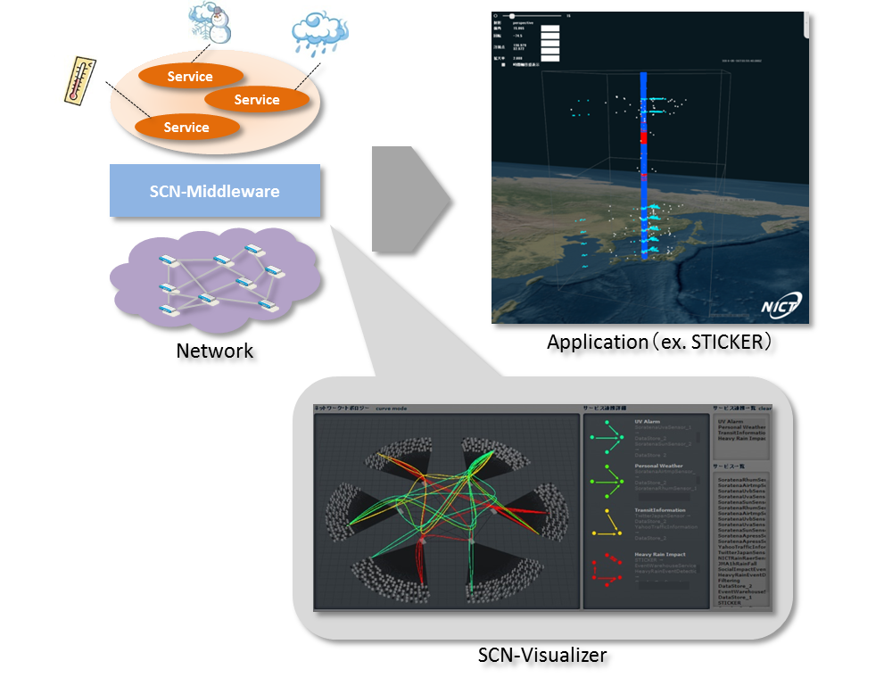
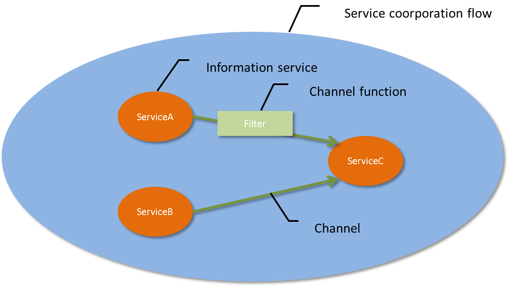
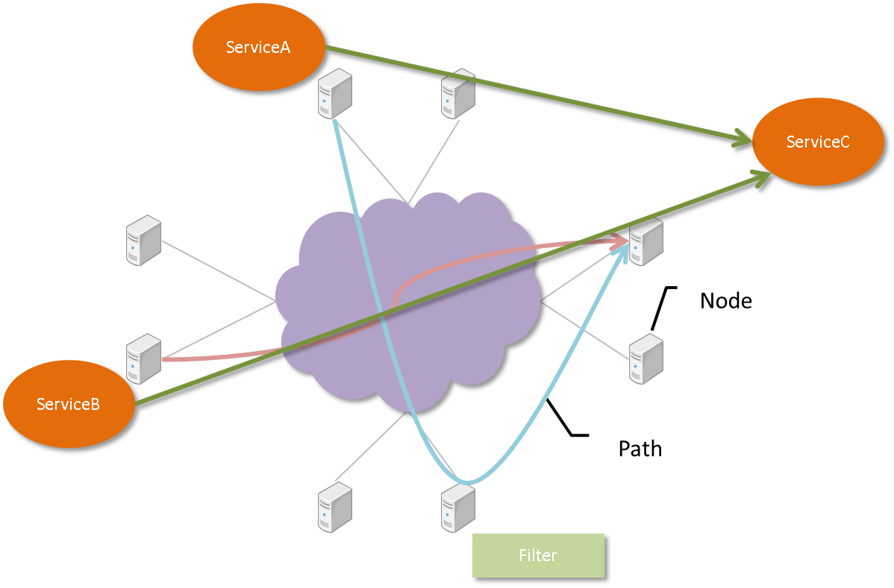
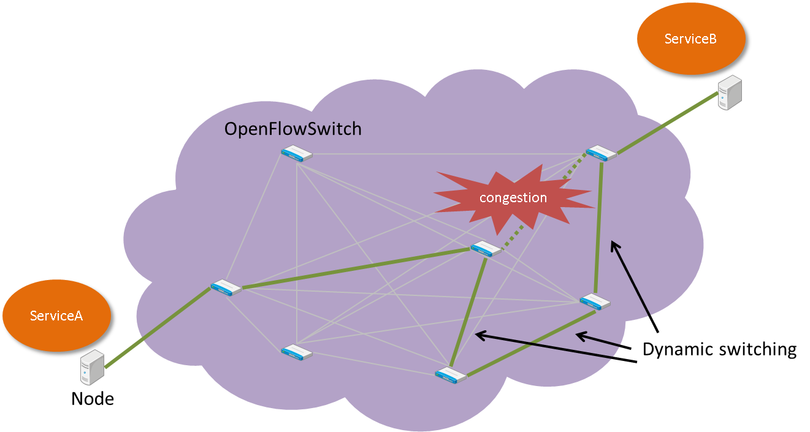

=============
What is SCN?
=============
* Service-Controlled Networking (SCN) is the technology that provides the capability to configure network resources automatically according to the application requests, and to cooperate efficiently with various information services that configure applications.
* This enables the user to analyze sensor data or social data cross-sectionally in various fields, and to create services that discover new value.
* Furthermore, when an unexpected event is detected using sensor data, it enables intensive collection and analysis of sensor data from various information collected around the area.

Features of SCN
================

Service search/Service cooperation
-----------------------------------
* It enables the user to find an information service that matches the specified search criteria from among the information services that are running separately on each node.
* Additionally, by cooperating with the information services found, it enables the user to collect as much data as necessary.

In-Network Data Processing
---------------------------
* When collecting data in cooperation with information services, it enables the user to perform processes such as filtering or compilation on the network.
* It enables the user to assign the optimum node to execute a Channel function, and to perform routing of a route that passes through the node.

Data communication route control
---------------------------------
* When congestion occurs on the network, it provides the capability of switching the data communication route dynamically to avoid congestion.

Declarative definition of Service search/Service cooperation
-------------------------------------------------------------
* It enables the user to define the information of service search and service cooperationdeclaratively with the following Declarative Service Networking (DSN).

::

    state do
        @jmarain: discovery(category=sensor, type=rain)
        @traffic: discovery(category=sensor, type=traffic)
        @store:   discovery(type=store, key=heavyrain)

        scratch: s_jmarain, @jmarain
        scratch: s_traffic, @traffic
        channel: c_store,   @store
    end

    bloom do
        c_store <~ s_jmarain.filter(rainfall >= 25 && range(latitude, 33.0, 37.0) && range(longitude, 134.0, 137.0)).meta(Table=JMA1hRainFall)

        event_heavyrain <+ c_store.trigger(30, count > 130, rainfall > 30)

        event_heavyrain.on do
            c_store <~ s_traffic.meta(Table=YahooTrafficInformation)
        end
    end

About SCN development
======================
SCN is an open source project that is being developed by Information Services Platform Laboratory in National Institute of Information and Communications Technology (http://nict.go.jp/univ-com/isp/index.html).

