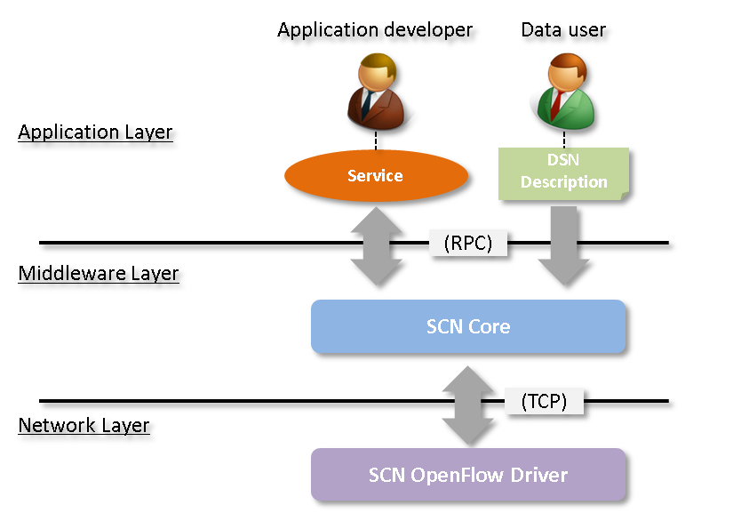
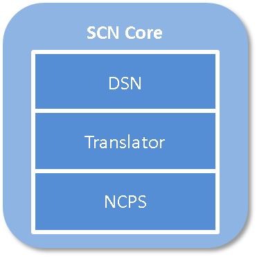
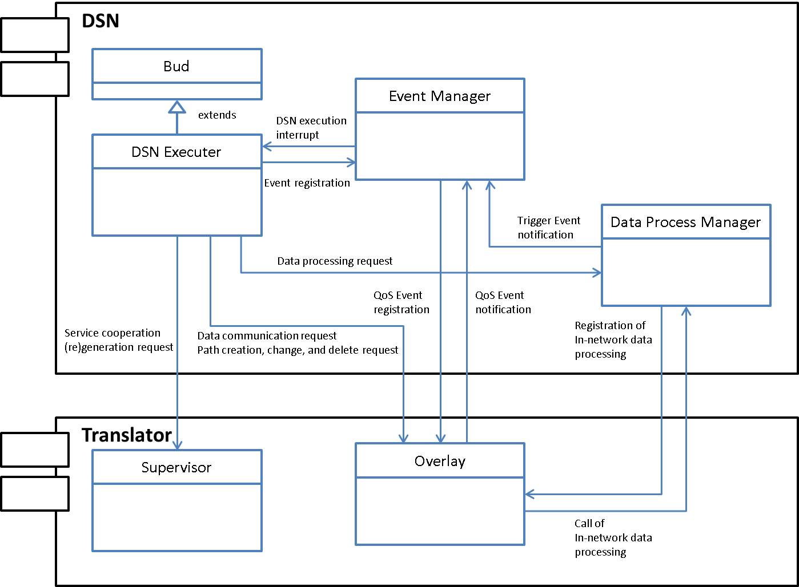
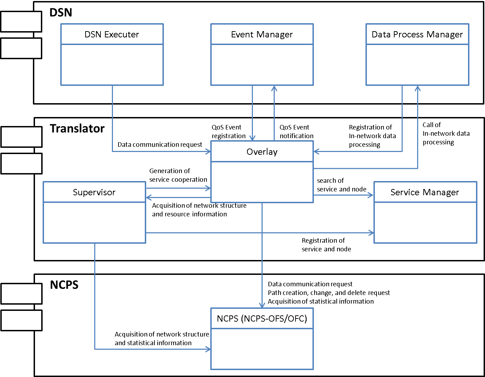
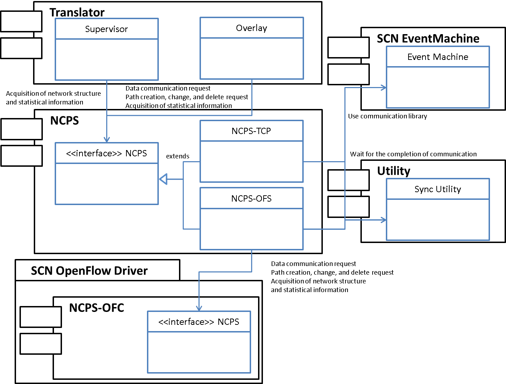

=============
Architecture
=============

SCN architecture
=================

* SCN has three layers: an **Application layer** , **Middleware layer** , and **Network layer**

Application layer
------------------
* In the application layer, information services operate and collect data from various data sources.
* Define the request of “I want data like this” in DSN and output it to SCN middleware.

Middleware layer
-----------------
* The middleware layer is run by the SCN Core. It translates and executes the DSN received from the application layer, and performs event detection or In-Network Data Processing.
* It manages the service search or service cooperation according to the description defined by DSN.
* Additionally, it calculates and creates a path for sending data that are received fromthe application layer.

Network layer
--------------
* It detects network topology or monitors network traffic.
* It switches a flow dynamically according to the network traffic to meet the requested QoS.

Architecture of SCN Core
=========================
* SCN Core consists of three components: **DSN** , **Translator**, and **NCPS** .

* See below for the processing of each component.

DSN
----

* DSN translates the inputted DSN description and sends commands to Translator to create service search or service cooperation.
* It manages event information that is defined in the DSN description, and judges if an event has occurred or not based on the QoS event notification or statistical information obtained from Translator.
* It performs data processing in the network (In-Network Data Processing) such as filtering or aggregation.

Translator
-----------

* Translator manages information related to the service and service cooperation.
* It searches services that are controlled by Translator and calculates path routes after receiving instructions from the DSN layer. Then it sends a command to NCPS to create a route.
* It acquires a network structure and statistical information against NCPS. Then it uses it for the route calculation of path and sends it to DSN to determine the event.

NCPS
-----

* NCPS acquires the network structure or statistical information and notifies Translator.
* It sets necessary network settings according to the path creation request that is sent from Translator.
* In case OpenFlow is used as network layer, it sends a command to SCN OpenFlow Driver to set a flow or does something.

Configuration
==============

* The following is to describe the configuration that can be configured by SCN Core.

Log settings
-------------

* Log level can be set as stated below.

=========== ====================================
Log level   Message to be output
=========== ====================================
FATAL       FATAL only
ERROR       FATAL + ERROR
WARN        FATAL + ERROR + WARN
INFO        FATAL + ERROR + WARN + INFO
DEBUG       FATAL + ERROR + WARN + INFO + DEBUG
=========== ====================================

::

  # Log level
  $logger.level = Logger::INFO

Sending destination settings of log information/status
-------------------------------------------------------
::

  # fluend setting
  @fluent_port       = 24224
  @fluent_ip_address = "172.18.102.1"

RPC settings for communication with applications
-------------------------------------------------
::

  #  RPC initial receiving port
  @rpc_initial_rx_port = 10000

  # RPC receiving port
  @rpc_rx_port = 21001

  # RPC sending base port
  @rpc_tx_port_base = 22000

  # RPC sending IP address
  @rpc_ip_address = "127.0.0.1"

Translator operation interval settings
---------------------------------------

::

  # Node information sending interval [s]
  @statistics_interval = 30

NCPS network type settings
^^^^^^^^^^^^^^^^^^^^^^^^^^^
* The network type can be set as described below

================= =======================================
Network Type      Description
================= =======================================
OpenFlow          Use OpenFlow as Network layer
TCP               Use TCP/IP as Network layer
================= =======================================

::

  # Network type
  $ncps_network = "OpenFlow"

Data communication port settings
^^^^^^^^^^^^^^^^^^^^^^^^^^^^^^^^^
::

    # Data message base port
    @data_port_base = 11001

    # Upper limit of data message port
    @data_port_max = 20000

    # Control message port
    @ctrl_port = 20001

Communication settings with SCN OpenFlow Driver
^^^^^^^^^^^^^^^^^^^^^^^^^^^^^^^^^^^^^^^^^^^^^^^^
::

  # Communication port with SCN OpenFlow Driver
  @cmd_port = 31001

